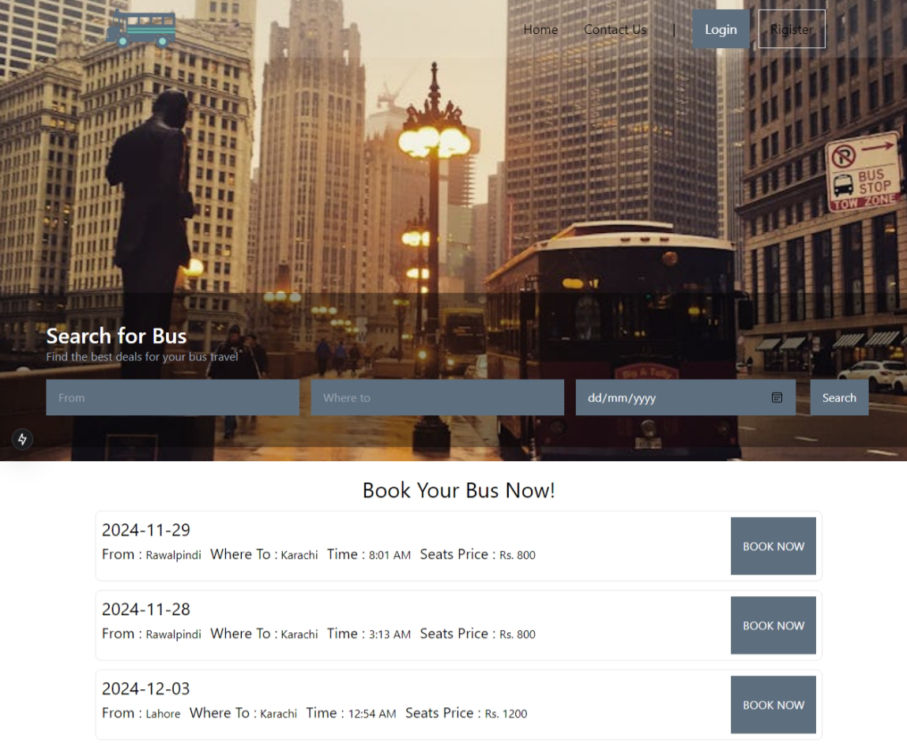

# 🚌 Bus Management System (BMS)

A modern, full-stack web application for managing bus bookings and operations. Built with Next.js, MongoDB, and NextAuth for a seamless user experience.



## 📋 Table of Contents

- [Features](#features)
- [Tech Stack](#tech-stack)
- [Prerequisites](#prerequisites)
- [Installation](#installation)
- [Configuration](#configuration)
- [Running the Application](#running-the-application)
- [Project Structure](#project-structure)
- [API Endpoints](#api-endpoints)
- [Features Overview](#features-overview)
- [Contributing](#contributing)

## ✨ Features

### 🎯 Core Features
- **User Authentication**: Secure login/register system with NextAuth
- **Bus Booking**: Real-time bus search and booking functionality
- **Admin Panel**: Comprehensive admin dashboard for bus management
- **User Dashboard**: Personal booking history and profile management
- **Real-time Search**: Dynamic search with autocomplete
- **Responsive Design**: Mobile-friendly interface
- **Dark/Light Theme**: Theme switching capability
- **File Upload**: Image upload for bus details
- **PDF Generation**: Booking confirmation PDFs

### 🔐 User Roles
- **Regular Users**: Can search, book buses, and manage their bookings
- **Admin Users**: Can manage buses, users, and view all bookings
- **Super Admin**: Full system access and admin management

## 🛠️ Tech Stack

- **Frontend**: Next.js 15, React 18, Tailwind CSS
- **Backend**: Next.js API Routes
- **Database**: MongoDB with Mongoose
- **Authentication**: NextAuth.js
- **Styling**: Tailwind CSS, Framer Motion
- **File Upload**: Multer
- **PDF Generation**: jsPDF
- **HTTP Client**: Axios
- **Password Hashing**: bcryptjs

## 📋 Prerequisites

Before running this project, make sure you have:

- **Node.js** (v18 or higher)
- **npm** or **yarn** package manager
- **MongoDB** installed and running locally
- **Git** for version control

## 🚀 Installation

1. **Clone the repository**
   ```bash
   git clone https://github.com/UmairZakria/bus-management-system
   cd bms
   ```

2. **Install dependencies**
   ```bash
   npm install
   # or
   yarn install
   ```

3. **Set up MongoDB**
   - Make sure MongoDB is running on your local machine
   - The application will connect to `mongodb://localhost:27017/bms2`

## ⚙️ Configuration

### Environment Variables
Create a `.env.local` file in the root directory:

```env
# NextAuth Configuration
NEXTAUTH_URL=http://localhost:3000
NEXTAUTH_SECRET=your-secret-key-here

# MongoDB Configuration (if using remote database)
MONGODB_URI=mongodb://localhost:27017/bms2

# File Upload Configuration
UPLOAD_DIR=public/uploads
```

### Database Setup
The application will automatically create the necessary collections:
- `users` - User accounts and profiles
- `buses` - Bus information and schedules
- `bookings` - Booking records
- `admins` - Admin user accounts
- `messages` - User messages and support

## 🏃‍♂️ Running the Application

### Development Mode
```bash
npm run dev
# or
yarn dev
```

Open [http://localhost:3000](http://localhost:3000) in your browser.

### Production Build
```bash
npm run build
npm start
```

## 📁 Project Structure

```
bms/
├── app/                    # Next.js App Router
│   ├── api/               # API Routes
│   │   ├── auth/          # Authentication endpoints
│   │   ├── admin/         # Admin management
│   │   ├── onbus/         # Bus operations
│   │   └── upload/        # File upload handling
│   ├── Home/              # Home page components
│   ├── Login/             # Authentication pages
│   ├── Panel/             # Admin dashboard
│   ├── Bookbus/           # Booking functionality
│   └── models/            # MongoDB schemas
├── components/            # Reusable UI components
├── lib/                   # Utility functions
├── public/               # Static assets
└── Pics/                 # Project screenshots
```

## 🔌 API Endpoints

### Authentication
- `POST /api/auth/[...nextauth]` - NextAuth authentication
- `POST /api/register` - User registration
- `POST /api/login` - User login

### Bus Management
- `GET /api/onbus` - Get all buses
- `POST /api/addbus` - Add new bus
- `PUT /api/admin/bus/:id` - Update bus details
- `DELETE /api/admin/bus/:id` - Delete bus

### Booking System
- `POST /api/bookbus` - Create booking
- `GET /api/bookings` - Get user bookings
- `GET /api/admin/bookings` - Get all bookings

### File Upload
- `POST /api/upload` - Upload bus images

## 🎯 Features Overview

### 🔍 Smart Search System
- Real-time bus search with autocomplete
- Filter by destination and date
- Available seats display
- Price comparison

### 📱 Responsive Design
- Mobile-first approach
- Cross-browser compatibility
- Touch-friendly interface
- Progressive Web App features

### 🎨 Modern UI/UX
- Clean, intuitive interface
- Smooth animations with Framer Motion
- Loading states and progress indicators
- Error handling and user feedback

### 🔒 Security Features
- Password hashing with bcryptjs
- JWT-based authentication
- Protected routes and API endpoints
- Input validation and sanitization

## 🚀 Getting Started Guide

### For Users
1. **Register/Login**: Create an account or sign in
2. **Search Buses**: Use the search bar to find available buses
3. **Book a Seat**: Select your preferred bus and seat
4. **Confirm Booking**: Review details and confirm
5. **Download Ticket**: Get your booking confirmation as PDF

### For Admins
1. **Admin Login**: Access admin panel with admin credentials
2. **Manage Buses**: Add, edit, or remove buses
3. **View Bookings**: Monitor all bookings and user activity
4. **User Management**: Manage user accounts and permissions
5. **System Settings**: Configure system parameters

## 🤝 Contributing

1. Fork the repository
2. Create a feature branch (`git checkout -b feature/amazing-feature`)
3. Commit your changes (`git commit -m 'Add amazing feature'`)
4. Push to the branch (`git push origin feature/amazing-feature`)
5. Open a Pull Request

## 📝 License

This project is licensed under the MIT License - see the [LICENSE](LICENSE) file for details.

## 🆘 Support

If you encounter any issues or have questions:

1. Check the [Issues](https://github.com/UmairZakria/bus-management-system/issues) page
2. Create a new issue with detailed information
3. Contact the development team

---

**Built with ❤️ using Next.js and MongoDB**

*Last updated: December 2024*
